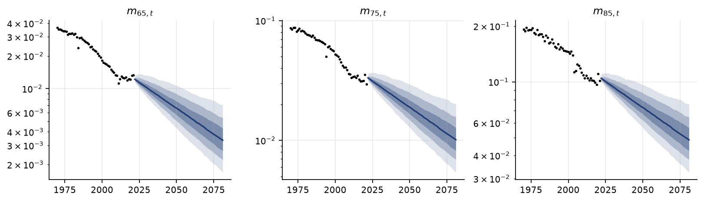
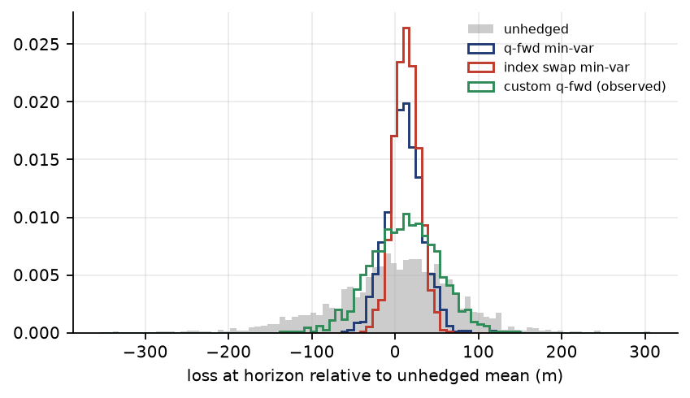
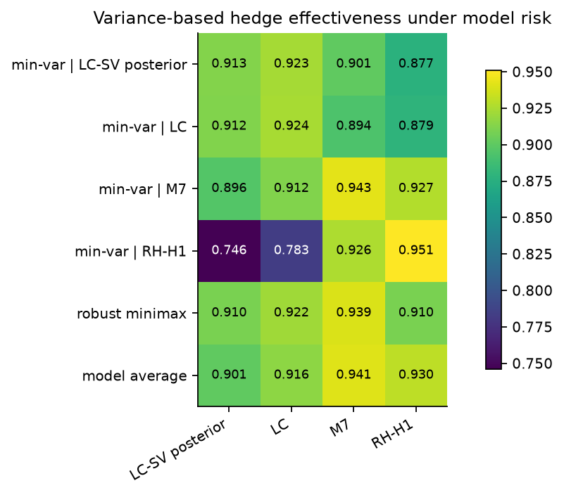

# Pension Longevity Hedging

A defined-benefit pension scheme pays members for as long as they live, and it discounts those payments using gilt yields. So longevity risk and interest-rate risk hit the same liability at the same time. This repo models both on real UK data and compares a few ways of hedging them.

The question I kept coming back to was simple. Hedges are usually optimised under one mortality model, so what happens to the hedge if that model turns out to be wrong?

## What I found

**Tuning a hedge to one mortality model is risky.** A hedge built for RH-H1 reaches 95.1% effectiveness if RH-H1 is right, but falls to 74.6% if mortality actually behaves like the LC-SV posterior. A minimax hedge gives up a few points in the best case and stays above 91% under every model I tested.

**Fixing the volatility parameters understates the tail.** The 99.5% expected shortfall on the liability is £242m when I carry the full parameter uncertainty through, and £184m when I fix the parameters at point estimates. That's roughly 30% more risk.

**The mortality model changes the liability itself.** Mean liability is £3,405m under RH-H1 and £3,260m under the LC-SV posterior, a gap of about 4.5%.

**Basis risk is bigger than the correlations suggest.** A q-forward basket priced off realistically observable rates has a correlation of 0.838 with the liability, against 0.963 when priced off the true rates. Variance reduction is roughly correlation squared, so that's about 70% against 93%.

**The samplers agree.** PMMH, correlated PMMH and PGAS give the same posterior for the stochastic-volatility mortality index, so I'm fairly confident the result isn't an artefact of one method.





## The data

Mortality is UK male deaths and cohort exposures from the Human Mortality Database, ages 55 to 95, 1970 to 2021. Yield curves are Bank of England nominal gilt curves over the same period. The scheme has 6,231 deferred members (average age 59.5) and 12,000 pensioners (average age 77.5), with an average benefit of about £9,800 a year. The scheme population itself is synthetic: it's derived from the real reference population (`derive_scheme` in `src/pipeline/stages.py`) rather than taken from a published scheme, since real scheme-level mortality data isn't public.

## How it fits together

`run.py` runs the pipeline in stages:

1. Fit classical mortality models (Lee-Carter, CBD M5 and M7, Renshaw-Haberman H1, Li-Lee) and backtest them.
2. Re-estimate the mortality index as a state-space model with stochastic volatility and jumps, using three particle samplers.
3. Fit the interest-rate models (dynamic Nelson-Siegel and Hull-White).
4. Generate scenarios, value the liabilities and price the longevity instruments.
5. Optimise hedges, measure how well they work, and test them across mortality models.

None of the individual methods are new. What I built is the pipeline that connects them, so mortality, rates and hedging risk can be looked at together. The papers each piece follows:

| Piece | Paper | Code |
|---|---|---|
| Lee-Carter, SVD and Poisson fit | Lee & Carter (1992); Brouhns, Denuit & Vermunt (2002) | `src/mortality/lee_carter.py` |
| CBD M5 and M7 | Cairns, Blake & Dowd (2006); Cairns et al. (2009) | `src/mortality/cbd.py` |
| Renshaw-Haberman, H1 restriction | Renshaw & Haberman (2006); Haberman & Renshaw (2011) | `src/mortality/renshaw_haberman.py` |
| Li-Lee two-population model | Li & Lee (2005) | `src/mortality/multipopulation.py` |
| PMMH | Andrieu, Doucet & Holenstein (2010) | `src/inference/pmmh.py` |
| Correlated pseudo-marginal | Deligiannidis, Doucet & Pitt (2018) | `src/inference/pmmh.py` |
| Particle Gibbs, ancestor sampling | Lindsten, Jordan & Schön (2014) | `src/inference/pgas.py` |
| Dynamic Nelson-Siegel | Diebold & Li (2006) | `src/rates/nelson_siegel.py` |
| Hull-White | Hull & White (1990) | `src/rates/hull_white.py` |
| Wang transform for hedge pricing | Wang (2000) | `src/instruments/longevity.py` |

## Results

All of this comes from `configs/real_data_validation.yaml` with seed 42. The full tables are in `outputs/real_data_validation/tables/`.

### Mortality models

Higher is better here (AIC* is log-likelihood minus the number of parameters, and BIC* is the BIC-style equivalent).

| Model | Log-lik | Params | AIC* | BIC* |
|---|---|---|---|---|
| M7 | -12,870.2 | 237 | -13,107.2 | -13,777.4 |
| RH-H1 | -13,197.8 | 215 | -13,412.8 | -14,020.7 |
| LC | -23,499.5 | 132 | -23,631.5 | -24,005.4 |
| LC-SVD | -23,621.8 | 132 | -23,753.8 | -24,127.7 |
| M5 | -31,986.8 | 104 | -32,090.8 | -32,385.4 |

M7 fits best and RH-H1 is close behind. Out of sample, M7's one-year RMSE is 0.0345 against 0.0542 for LC. The bigger difference is calibration: M7's 95% intervals cover 95.8% of outcomes, while LC's cover only 59.6%, so LC is badly overconfident. In the two-population fit the shared factor explains 97.9% of the variance in the reference population but only 81.4% in the scheme population, which is smaller and noisier.

### Stochastic-volatility mortality index

| Sampler | μ | φ | σ_h | Jump prob | Acceptance | Wall time |
|---|---|---|---|---|---|---|
| PMMH | -0.794 | 0.802 | 0.325 | 0.052 | 25.1% | 332.7 s |
| CPM-PMMH | -0.786 | 0.801 | 0.328 | 0.045 | 24.9% | 192.7 s |
| PGAS | -0.793 | 0.797 | 0.332 | 0.047 | n/a | 248.3 s |

CPM-PMMH gets the same acceptance as plain PMMH in about 58% of the time. PGAS has the best effective sample size per second (up to about 12/s on μ). As a sanity check, on the linear non-SV model PMMH accepts at 0.363 against 0.379 for the exact Kalman filter.

### Rates and scenario risk

The Nelson-Siegel fit gives λ = 0.731 with a very persistent level factor (φ = 0.993). Hull-White comes out at a = 0.079 and σ = 0.016.

| Scenario set | Mean liability (£m) | Liability sd | ES 99.5% (£m) | Own min-var HE |
|---|---|---|---|---|
| LC-SV posterior | 3,259.7 | 2.27% | 242.4 | 91.3% |
| LC-SV fixed θ | 3,257.0 | 2.11% | 184.4 | 91.1% |
| LC-SV no recalibration | 3,262.4 | 2.24% | 230.5 | 89.1% |
| LC | 3,249.7 | 2.35% | 197.2 | 92.4% |
| M7 | 3,271.5 | 3.36% | 336.4 | 94.3% |
| RH-H1 | 3,404.8 | 3.17% | 345.8 | 95.1% |

### Hedging

Longevity-only q-forward baskets cut liability variance by about 90 to 91%, and a single index swap (LS70) reaches 95.8%. Hedging rates and longevity together does better than either alone:

| Rate model | Best strategy | Hedge effectiveness | Residual sd | Correlation |
|---|---|---|---|---|
| DNS | joint min-var | 98.9% | 50.5 | 0.995 |
| Hull-White | joint min-var | 99.1% | 26.0 | 0.995 |

For comparison, longevity-only hedges reach about 91 to 93% and rates-only hedges about 93 to 97%.

### Model risk

Each row is a hedge built under one assumption, and each column is the mortality model that turns out to be true.

| Hedge built for | LC-SV post. | LC | M7 | RH-H1 | Worst case |
|---|---|---|---|---|---|
| min-var \| LC-SV post. | 91.3% | 92.3% | 90.1% | 87.7% | 87.7% |
| min-var \| RH-H1 | 74.6% | 78.3% | 92.6% | 95.1% | 74.6% |
| Robust minimax | 91.0% | 92.2% | 93.9% | 91.0% | 91.0% |
| Model average | 90.1% | 91.6% | 94.1% | 93.0% | 90.1% |

### Cost

With a Wang-transform risk premium, expected hedge cost goes from about £0 at λ = 0 to £10.3m (31.5bp of the initial liability) at λ = 0.15, and £20.3m (62.2bp) at λ = 0.3. The fixed rates on the q-forwards run from 0.99% at age 65 to 8.83% at age 85, which reflects how much more mortality-improvement risk there is at older ages.

## Running it

```bash
python -m pip install -r requirements.txt
pytest -q

python run.py --config configs/quick.yaml        # fast run on synthetic data
python run.py --config configs/real_data_validation.yaml \
              --output outputs/real_data_validation --seed 42
```

`--max-seconds` pauses a run after a time budget and `--resume` picks it back up from the checkpoints. Everything is written to the output folder as CSV tables, PNG figures and a `summary.json`.

## Caveats

This is a research project, not production actuarial software. A few things to keep in mind when reading the numbers:

- The hedge effectiveness figures, especially the 99% for joint hedging, come from the same scenario set that the hedges are optimised on, so they're best read as optimistic — this is in-sample, not out-of-sample, evaluation.
- Liabilities and scenarios both come from the same models, so effectiveness is measured inside my own modelling framework. The model-risk table is the only real check on that.
- Hull-White is calibrated to historical short rates because there's no swaption or cap data in the project.
- The model comparison puts log-likelihoods from different fitting routes side by side. The backtests are the more reliable guide.
- 2020 and 2021 are included in the mortality data with no special adjustment for COVID-era mortality.

## References

- Andrieu, C., Doucet, A. & Holenstein, R. (2010). Particle Markov chain Monte Carlo methods. *JRSS B*, 72(3), 269-342.
- Brouhns, N., Denuit, M. & Vermunt, J. K. (2002). A Poisson log-bilinear regression approach to the construction of projected lifetables. *Insurance: Mathematics and Economics*, 31(3), 373-393.
- Cairns, A. J. G., Blake, D. & Dowd, K. (2006). A two-factor model for stochastic mortality with parameter uncertainty. *Journal of Risk and Insurance*, 73(4), 687-718.
- Cairns, A. J. G. et al. (2009). A quantitative comparison of stochastic mortality models using data from England and Wales and the United States. *North American Actuarial Journal*, 13(1), 1-35.
- Deligiannidis, G., Doucet, A. & Pitt, M. K. (2018). The correlated pseudo-marginal method. *JRSS B*, 80(5), 839-870.
- Diebold, F. X. & Li, C. (2006). Forecasting the term structure of government bond yields. *Journal of Econometrics*, 130(2), 337-364.
- Haberman, S. & Renshaw, A. (2011). A comparative study of parametric mortality projection models. *Insurance: Mathematics and Economics*, 48(1), 35-55.
- Hull, J. & White, A. (1990). Pricing interest-rate-derivative securities. *Review of Financial Studies*, 3(4), 573-592.
- Lee, R. D. & Carter, L. R. (1992). Modeling and forecasting U.S. mortality. *JASA*, 87(419), 659-671.
- Li, N. & Lee, R. (2005). Coherent mortality forecasts for a group of populations. *Demography*, 42(3), 575-594.
- Lindsten, F., Jordan, M. I. & Schön, T. B. (2014). Particle Gibbs with ancestor sampling. *JMLR*, 15, 2145-2184.
- Renshaw, A. E. & Haberman, S. (2006). A cohort-based extension to the Lee-Carter model for mortality reduction factors. *Insurance: Mathematics and Economics*, 38(3), 556-570.
- Wang, S. S. (2000). A class of distortion operators for pricing financial and insurance risks. *Journal of Risk and Insurance*, 67(1), 15-36.
